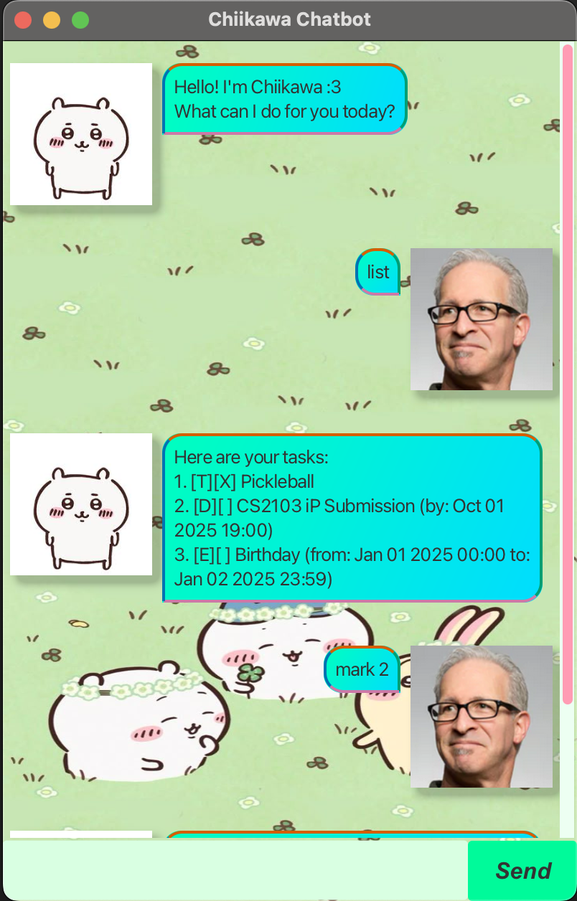

# Chiikawa Chatbot User Guide



Chiikawa helps you keep track of all your tasks! It 
allows you to add todos, deadlines and events!

## List all your tasks

Lists all your tasks in your current list.
Format: `list`

Expected output:
```
Here are your tasks:
1. [T][X] Read book
2. [D][ ] Submit report (by: Sep 15 2025 23:59)
3. [D][ ] Finish project (by: Sep 20 2025 18:00)
4. [E][ ] Team meeting (from: Sep 18 2025 14:00 to: Sep 18 2025 16:00)
```

## Marking tasks as completed

Marks a task as completed in your list.
Format: `mark <index>`

Expected output:
```
Nice! I've mark this task as done:
  [D][X] Assignment 1 (by: Sep 13 2025 23:59)
```

## Unmarking tasks

Unmarks a task as not completed from your list.
Format: `unmark <index>`

Expected output:
```
OK, I've marked this task as not done yet:
  [D][ ] Assignment 1 (by: Sep 13 2025 23:59)
```

## Adding todos

Adds a todo task to your list.
Format: `todo <description>`

Example: `todo Buy groceries`

Expected output:

```
Got it. I've added this task:
  [T][ ] Buy groceries
Now you have <x> tasks in the list.
```

## Adding deadlines

Adds a deadline task to your list.
Format: `deadline <description> /by <yyyy-MM-dd HHmm>`

Example: `deadline Assignment 1 /by 2025-09-13 2359`

Expected output:

```
Got it. I've added this task:
  [D][ ] Assignment 1 (by: Sep 13 2025 23:59)
Now you have <x> tasks in the list.
```

## Adding events

Adds an event task to your list.
Format: `event <description> /from <yyyy-MM-dd HHmm> /to <yyyy-MM-dd HHmm>`

Example: `event Tutorial /from 2025-09-18 1600 /to 2025-09-18 1800`

Expected output:
```
Got it. I've added this task:
  [E][ ] Tutorial (from: Sep 18 2025 16:00 to: Sep 18 2025 18:00)
Now you have <x> tasks in the list.
```

## Deleting tasks

Deletes a task from your list permanently.
Format: `delete <index>`

Expected output:
```
Noted, I've removed this task:
  [D][X] Assignment 1 (by: Sep 13 2025 23:59)
Now you have <x> tasks in the list.
```

## Finding tasks

Finds a task from your list from a given keyword.
Format: `find <keyword>`

Example: `find Assignment`

Expected output:
```
Here are the matching tasks in your list:
1. [D][X] Assignment 1 (by: Sep 13 2025 23:59)
```

## Updating tasks

Updates a task's information based on the type of task and field.
Format: `update <index> <field> <value>`

Examples:
1. `update 2 /description Tutorial 3`
2. `update 3 /from 2025-09-17 2359`
3. `update 4 /by 2025-10-01 1600`

Expected output:
1. ```
   Got it! I've updated the task:
   [D][X] Tutorial 3 (by: Oct 01 2025 19:00)
   ```
2. ```
   Got it! I've updated the task:
   [D][X] Hackathon (from: Sep 17 2025 23:59 to: Sep 19 2025 23:59)
   ```
3. ```
   Got it! I've updated the task:
   [D][X] Project Submission (by: Oct 01 2025 16:00)
   ```
   
## Exiting the program

Exits the program
Format: `bye`
   